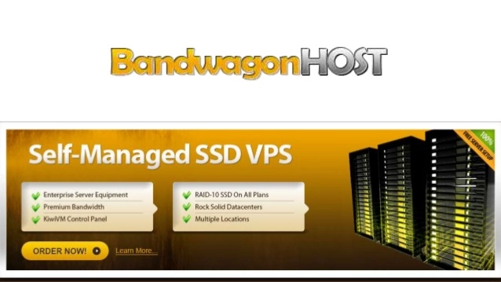

# Top NVMe SSD VPS Hosting | Fast and Reliable Servers

---

Picking a VPS with NVMe SSDs isn't just about raw speed—though yeah, they're way faster than those old spinning HDDs. The real difference shows up when your site's under load: pages snap open, databases don't lag, and your users actually stick around. But here's the thing: not all NVMe hosts are created equal. You've got to watch out for oversold servers, sketchy IP reputations, and support that vanishes when things go sideways.

I've been running projects on various VPS platforms for years now—some great, some... not so much. After dealing with surprise bills, blocked IPs, and servers that crawl during peak hours, I figured I'd save you the headache. Below are five providers I've actually used, with the real story on what works and what doesn't.

---

## 1. LightNode VPS

LightNode's the new kid on the block—only popped up a couple years back—but their parent company's been running data centers since 2002. That experience shows. They've got nodes scattered across 20+ locations worldwide, and the pricing's refreshingly straightforward: $7.70/month to start, with hourly billing so you're not locked in.

What I like: full root access, a decent control panel, and their support actually responds. The 24/7 claim isn't just marketing—I've pinged them at odd hours and got real answers, not canned responses.

**Operating Systems:** Linux VPS, Windows VPS  
**Data Centers:** US, Germany, Turkey, Vietnam, Thailand, Cambodia, South Korea, South Africa, Bangladesh, Singapore, UAE, Saudi Arabia, Malaysia, Brazil, Philippines, Japan, Taipei, Hong Kong  
**Payment Methods:** Alipay, Credit Card, PayPal, Google Pay

**Ratings:**  
Hardware: ★★★☆☆  
Stability: ★★★★☆  
Speed: ★★★☆☆  
Support: ★★★★☆  
Overall: ★★★★☆

---

## 2. Vultr VPS

Vultr's been around the block—tons of data centers, hourly billing, easy server swaps. Sounds perfect, right? Well, here's where it gets messy. Back in 2019, they revamped the site and kept prices low (starting at $5/month), but the quality took a nosedive.

The problem: abuse. Lots of it. So many users did shady stuff that finding a clean IP became a lottery. New servers often land on blacklists before you even log in. For anything involving email or certain services, it's a nightmare. I've personally had to nuke and redeploy multiple times just to get a usable IP.

If you're thinking about Windows hosting, brace yourself—$16/month extra for licensing. That's on top of the base price. For quick testing or throwaway projects? Sure, Vultr works. For anything serious, especially websites, you might want to look elsewhere.

**Operating Systems:** Linux VPS, Windows VPS  
**Data Centers:** Seattle, Silicon Valley, Los Angeles, Dallas, Chicago, New Jersey, Atlanta, Miami, London, Paris, Frankfurt, Amsterdam, Tokyo, Singapore, Sydney  
**Payment Methods:** Alipay, WeChat, Credit Card, PayPal

**Ratings:**  
Hardware: ★★★☆☆  
Stability: ★★☆☆☆  
Speed: ★★★☆☆  
Support: ★★★★☆  
Overall: ★★★☆☆

---

## 3. DigitalOcean

DigitalOcean launched in 2012 and quickly became the fourth-largest cloud provider globally—not by accident. They're laser-focused on VPS hosting, unlike Amazon's sprawling cloud empire. Pricing mirrors Vultr ($5/month starting point, hourly billing), but the performance gap is noticeable.

Servers here generally run faster and more stable than Vultr's. The NVMe SSDs actually deliver on the speed promise, and I've had fewer random slowdowns. That said, they're not immune to the availability issues—sometimes spinning up new droplets takes a few tries.

Security's tight, maybe too tight if you're used to a more relaxed approach. But for developers and site owners who need reliability, DigitalOcean hits the mark. Just note: Linux only, no Windows option here.

**Operating Systems:** Linux VPS  
**Data Centers:** New York, San Francisco, Amsterdam, London, Singapore, India  
**Payment Methods:** Credit Card, PayPal

**Ratings:**  
Hardware: ★★★★☆  
Stability: ★★☆☆☆  
Speed: ★★★☆☆  
Support: ★★★★☆  
Overall: ★★★☆☆

---

## 4. Linode VPS

Linode sits in the same category as Vultr, but honestly? The interface feels clunky. Same pricing, no Windows support, and here's the kicker: they're super strict about traffic patterns.

Spike in bandwidth? Expect a warning email. Don't respond fast enough with an explanation? They might just delete your account. I get why they do it—abuse prevention—but it's stressful when you're running legitimate projects and suddenly get flagged.

Plus, like Vultr, finding a working machine can be hit-or-miss. And the mandatory credit card with auto-billing? Not everyone's favorite setup, especially if you're just testing the waters.

**Operating Systems:** Linux VPS  
**Data Centers:** Singapore, Japan (2 locations), US West, US Central, US East, Frankfurt, London  
**Payment Methods:** Credit Card

**Ratings:**  
Hardware: ★★★☆☆  
Stability: ★★☆☆☆  
Speed: ★★☆☆☆  
Support: ★★☆☆☆  
Overall: ★★☆☆☆

---

## 5. BandwagonHost

BandwagonHost used to be the budget hero—$19.90/year, crazy cheap. Then prices crept up to $49.90/year, but people stuck around because the speed was decent enough. "Good enough" became the motto.

Now? It's a mess. Massive IP abuse means most addresses are blacklisted. Paying $8 to swap IPs doesn't help—you'll likely land on another burned address. For hosting websites or anything requiring a clean reputation, it's a gamble you'll probably lose.

If you're considering affordable hosting that won't let you down when it matters, there are better choices out there. 👉 [Need reliable VPS hosting with clean IPs and solid performance? Check out providers that prioritize quality over quantity](https://bandwagonhost.com/aff.php?aff=79616). Finding a host that balances cost with actual usability makes all the difference, especially when your project's reputation is on the line.

**Operating Systems:** Linux VPS  
**Data Centers:** Los Angeles, New Jersey, Vancouver, Amsterdam  
**Payment Methods:** Alipay, Credit Card, PayPal

**Ratings:**  
Hardware: ★★☆☆☆  
Stability: ★★☆☆☆  
Speed: ★★★★☆  
Support: ★★★☆☆

---

## Wrapping Up

So there you have it—the real story on LightNode, Vultr, DigitalOcean, Linode, and BandwagonHost. Each has its crowd, and your choice really depends on what you're building and what you can't compromise on.

From my experience running sites and dev projects, LightNode delivers across the board—solid performance, decent support, and no nasty surprises. If you're shopping for VPS hosting, they're worth a look. But hey, your mileage may vary. Pick what fits your actual needs, not just what sounds good in the marketing copy.
